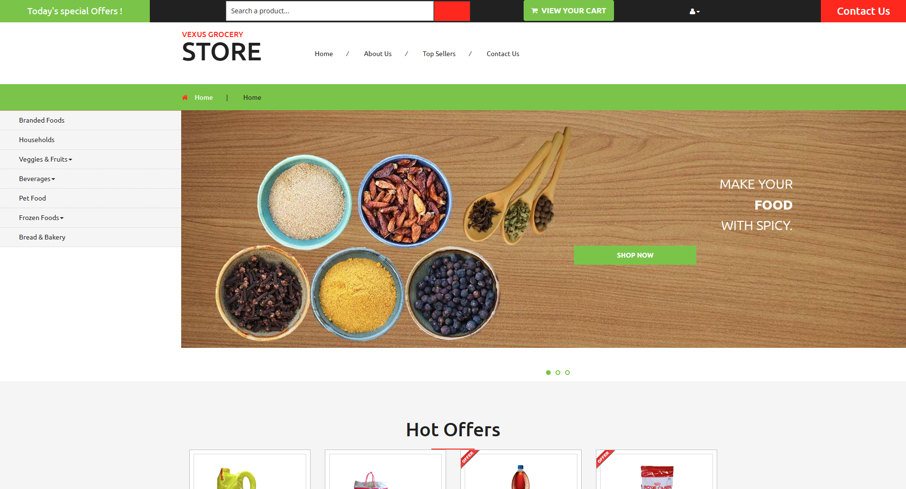
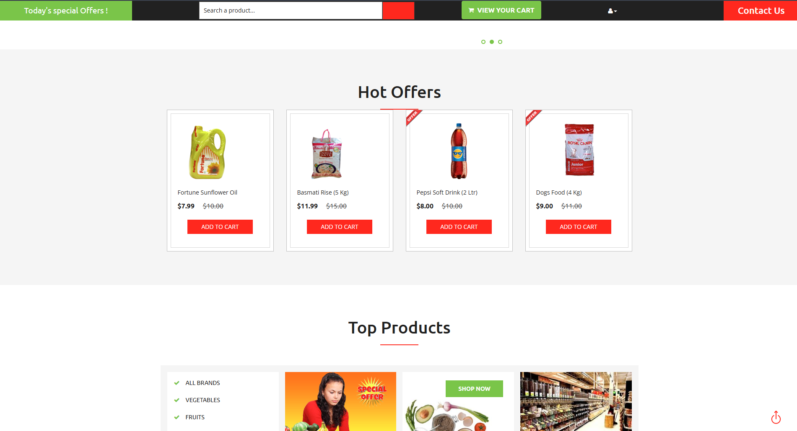
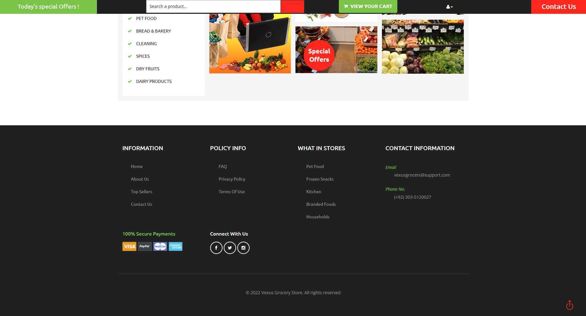
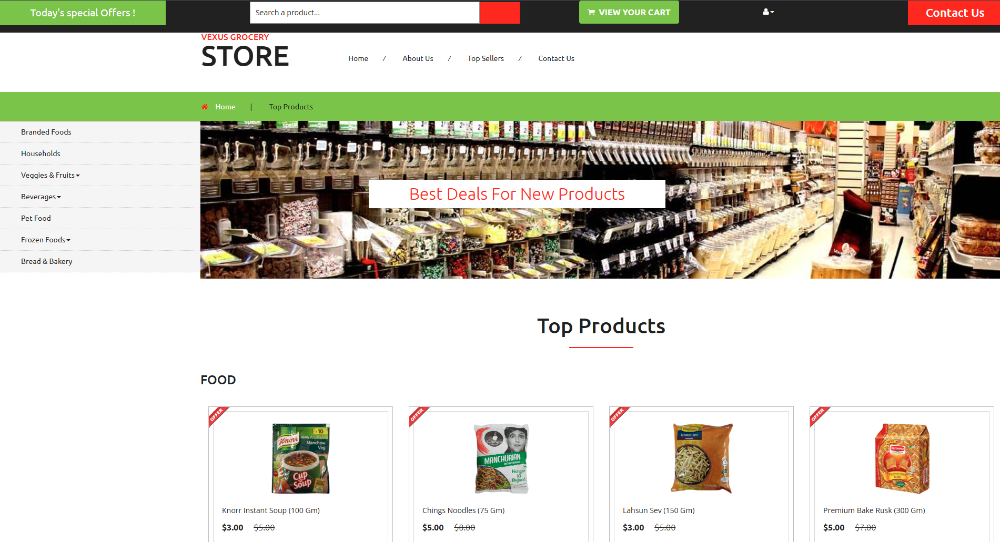
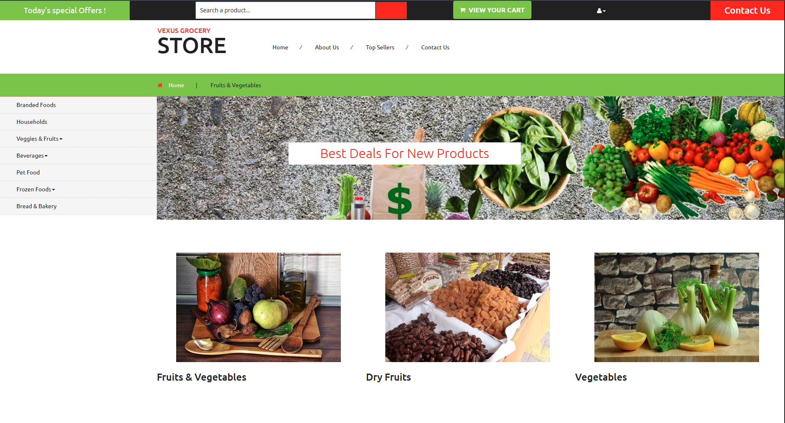
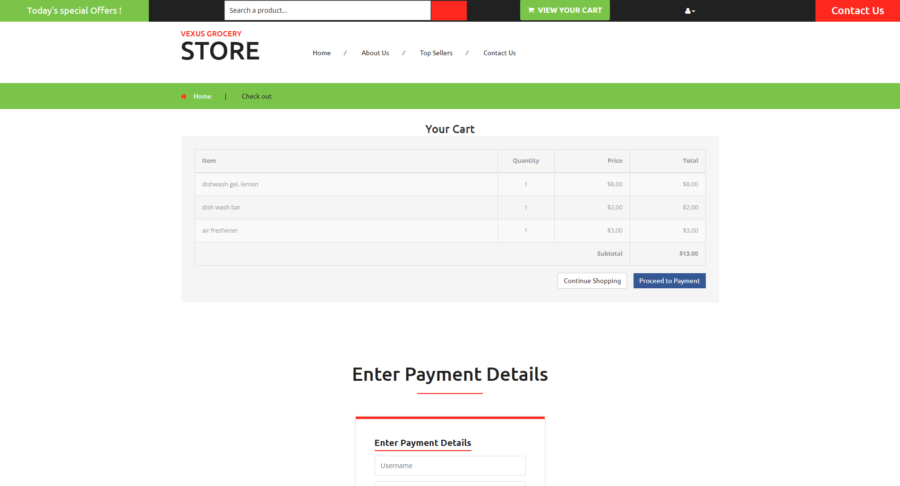
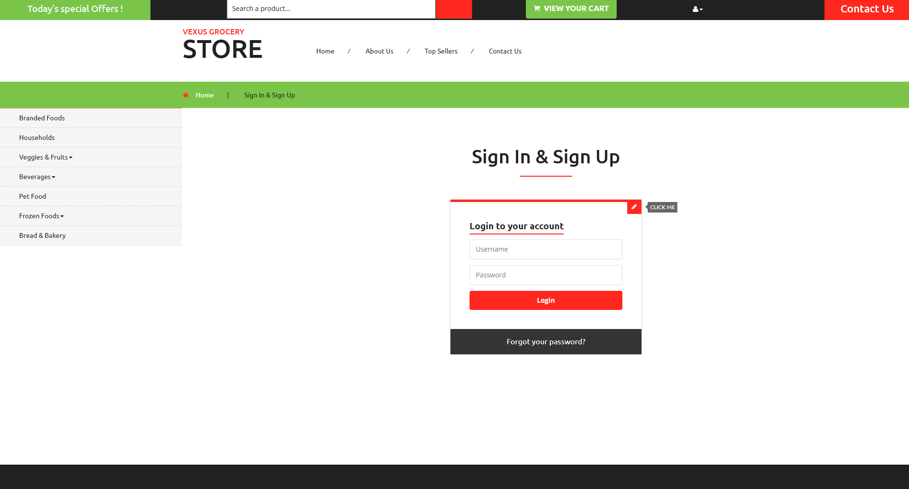
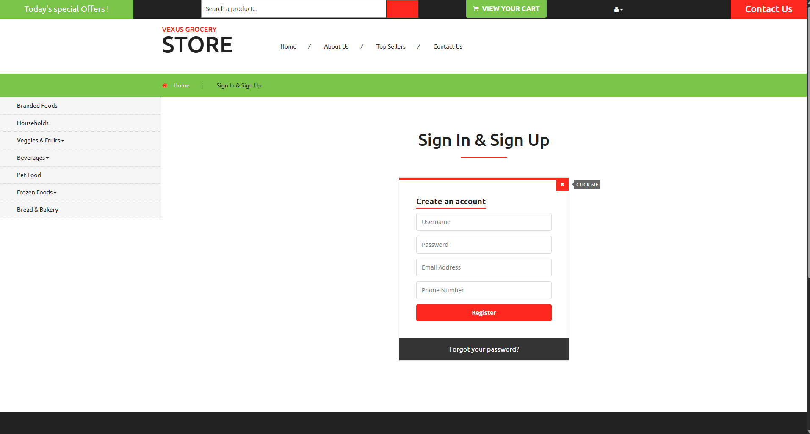
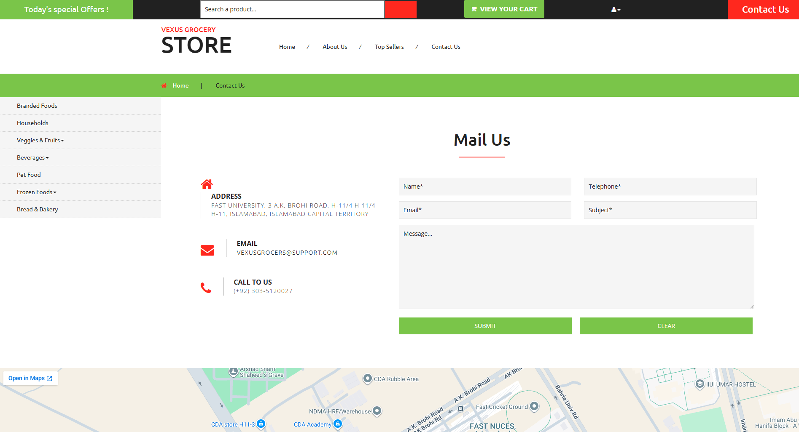
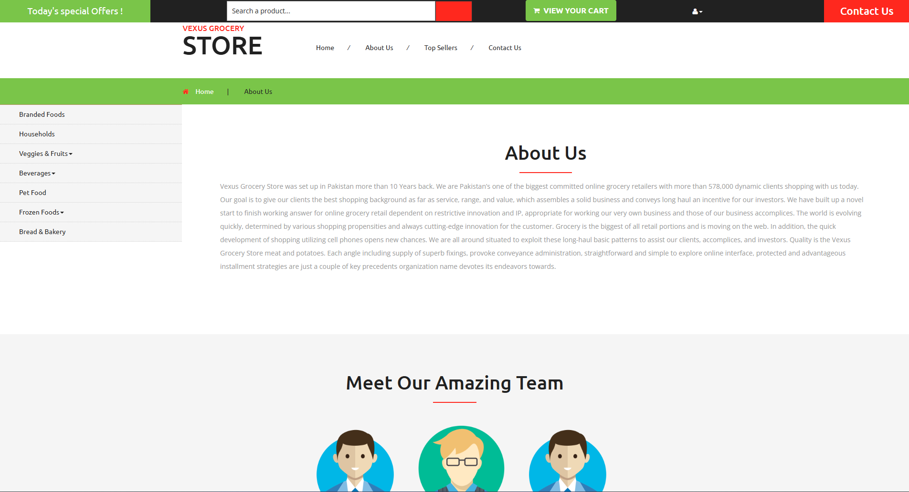

# Vexus Grocery Store

A responsive static grocery storefront built with HTML, CSS, JavaScript, Bootstrap, and jQuery. The site presents a multi-page grocery shopping experience with product departments, featured products, authentication screens, contact content, a mini cart demo, and a checkout page.

## Live App

https://vexus-grocery-store.vercel.app

## Features

- Responsive storefront layout built with Bootstrap.
- Home page with hero content, category navigation, featured sections, and product highlights.
- Product listing pages for groceries, bakery items, bread, drinks, frozen foods, household items, pet products, and vegetables.
- Demo mini cart interactions powered by the local minicart script.
- Checkout page for reviewing cart items and customer details.
- Login and signup screens for the storefront flow.
- Contact and about pages for store information.
- Local static assets for product images, icons, fonts, and UI styling.

## Tech Stack

| Part | Tech |
| --- | --- |
| Markup | HTML5 |
| Styling | CSS3, Bootstrap, Font Awesome |
| Scripting | JavaScript, jQuery |
| UI plugins | Flexslider, WMU Slider, Waypoints, CounterUp, OkZoom |
| Cart demo | Minicart |
| Deployment | Vercel |


## Screenshots

### Home



### Home Categories



### Featured Products



### Top Products



### Category Products



### Checkout



### Login



### Signup



### Contact



### About



## Project Structure

```text
.
|-- index.html                 # Home page
|-- about.html                 # About page
|-- products.html              # Product listing page
|-- checkout.html              # Checkout page
|-- login.html                 # Login and signup page
|-- mail.html                  # Contact page
|-- bakery-products.html       # Bakery category
|-- bread.html                 # Bread category
|-- drinks.html                # Drinks category
|-- frozen.html                # Frozen foods category
|-- household.html             # Household category
|-- pet.html                   # Pet products category
|-- vegetables.html            # Fruits and vegetables category
|-- css/                       # Bootstrap, Font Awesome, and site styles
|-- js/                        # jQuery, plugins, sliders, and minicart scripts
|-- images/                    # Product and storefront image assets
|-- fonts/                     # Local web font files
|-- assets/                    # README screenshots
`-- README.md
```

## Run Locally

Open `index.html` directly in a browser, or serve the folder with any static file server.

Using `npx serve`:

```bash
npx serve .
```

Then open the local URL shown in the terminal.

## Deployment

The site is static and can be deployed on Vercel with the repository root as the output directory. No build step is required.
